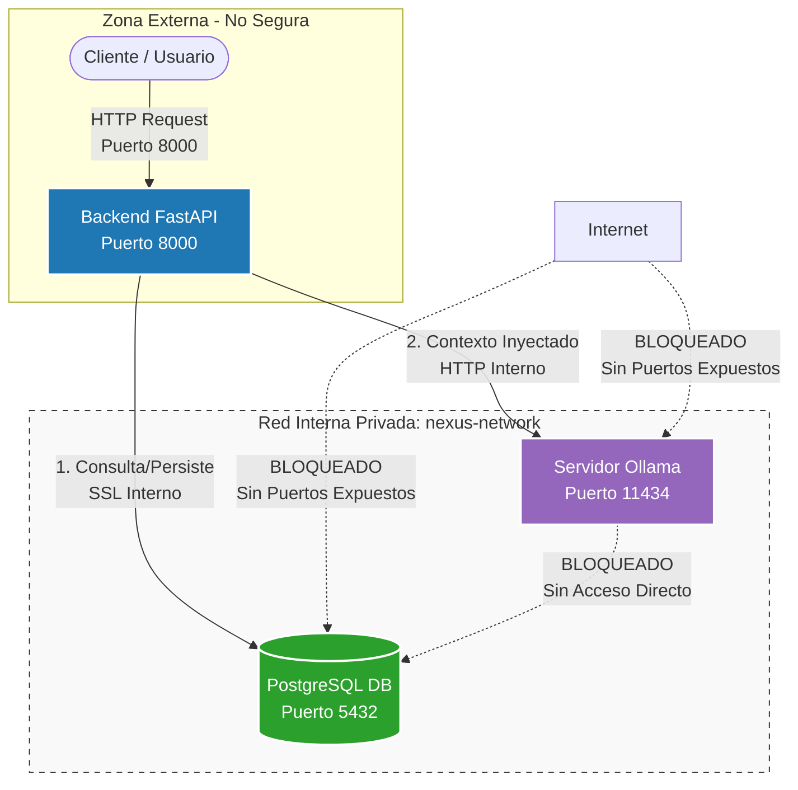

# Nexus Insight

## a. Descripción general del proyecto

<details> <summary>Descripción para técnicos (por defecto)</summary>

Nexus Insight es una plataforma de análisis documental inteligente diseñada bajo el paradigma Zero ‑Trust y una arquitectura monolito modular. Su objetivo es permitir la ingesta, procesamiento e inferencias RAG 100% locales, garantizando que la información confidencial nunca abandone la infraestructura física del cliente.

La IA se ejecuta en un contenedor aislado dentro de una red interna de Docker, cumpliendo los requisitos de soberanía de datos y seguridad corporativa.

Puntos clave para técnicos:

Seguridad y soberanía: Arquitectura y ejecución local para máxima privacidad.

Modularidad: Diseño escalable y mantenible.

Tecnología: Uso de FastAPI, PostgreSQL, SQLAlchemy asíncrono y Ollama para IA local.

Observabilidad: Logs JSON estructurados para diagnóstico y monitoreo, facilitando la detección rápida de errores y el análisis de rendimiento.

</details>

<details> <summary>Descripción para negocio</summary>

Nexus Insight es una solución segura y local para analizar documentos importantes dentro de la infraestructura de la empresa, sin que la información sensible salga de sus sistemas. Esto garantiza privacidad y cumplimiento normativo mientras se aprovecha la inteligencia artificial para obtener insights valiosos.

Puntos clave para negocio:

Privacidad y cumplimiento: Protección de datos sensibles y normativas.

Valor de negocio: Insights accionables para mejorar procesos.

Confianza: Solución local que evita riesgos de fuga de información.

</details>

<details> <summary>Descripción para marketing</summary>

Nexus Insight ofrece una plataforma innovadora que combina seguridad de datos y tecnología avanzada de inteligencia artificial para transformar la gestión documental. Ideal para empresas que buscan maximizar el valor de su información sin comprometer la privacidad.

Puntos clave para marketing:

Innovación: Tecnología avanzada y diferenciadora.

Seguridad: Mensaje claro de protección de datos.

Transformación: Impacto positivo en la gestión documental.

</details>

<details> <summary>Descripción para PMs y Producto</summary>

Nexus Insight está diseñado para ofrecer a los equipos de producto y gestión una visión clara y segura del análisis documental, facilitando la toma de decisiones basada en datos sin comprometer la privacidad ni la seguridad.

Puntos clave para PMs y Producto:

Visión estratégica: Datos confiables para decisiones informadas.

Seguridad: Cumplimiento y privacidad garantizados.

Facilidad de uso: Plataforma accesible para equipos multidisciplinares.

</details>

## b. Stack tecnológico utilizado

* Backend: FastAPI (ASGI) sobre Python 3.13.
* Validación: Pydantic v2 (tipado estricto).
* Base de datos: PostgreSQL 15 + SQLAlchemy 2.0 (async con asyncpg).
* IA Local: Ollama ejecutando el modelo qwen2.5-coder:1.5b en contenedor aislado.
* Infraestructura: Docker + Docker Compose.
* Automatización: `nexus.py` (MVP).
* Calidad de código: Ruff + pre‑commit + pre‑push (tests).
* Pruebas: Pytest + pytest-asyncio con mocking.

## c. Instalación y ejecución

Guía completa para poner el proyecto en funcionamiento desde un equipo con las herramientas base instaladas.

### Prerrequisitos

- Python 3.13+
- Docker + Docker Compose
- Git

### Pasos

0. Clonar el repositorio
```bash
git clone https://github.com/tu-org/nexus-insight.git
cd nexus-insight
```

1. Configurar variables de entorno
```bash
cp .env.example .env
```

2. Preparar el entorno Python local (necesario para herramientas de desarrollo: hooks, lint, tests)
```bash
python -m venv .venv
# Windows
.venv\Scripts\Activate.ps1
# Linux / macOS
# source .venv/bin/activate
pip install -r requirements.txt
```

3. Instalar hooks de git (se ejecutan automáticamente al commitear y al hacer push)
```bash
pre-commit install
pre-commit install --hook-type pre-push
```

4. Desplegar la infraestructura (API, base de datos, motor de IA)
```bash
docker compose up --build
```

5. Inicializar el modelo de IA (solo la primera vez)
```bash
docker compose exec ollama_service ollama run qwen2.5-coder:1.5b
```

6. Acceder a la documentación interactiva de la API

http://localhost:8000/docs

## d. Estructura del proyecto

Bloque corregido para evitar errores de interpretación en OpenCode.

nexus-insight/
├── docker-compose.yml
├── docker-compose.prod.yml
├── Dockerfile
├── .env
├── .env.example
├── .gitignore
├── .pre-commit-config.yaml
├── pytest.ini
├── requirements.txt
├── agents.md
├── ruff.toml
├── SECURITY.md                     ← invariantes de seguridad
├── SPEC.md
├── src/
│   ├── main.py                      ← entry point
│   ├── api/
│   │   └── v1/                      ← endpoints (controllers)
│   │       ├── auth.py              ← login JWT
│   │       ├── documents.py         ← CRUD documentos
│   │       ├── health.py            ← health check
│   │       └── web.py               ← frontend web (Jinja2/htmx)
│   ├── core/
│   │   ├── config.py                ← settings
│   │   ├── database.py              ← DB engine
│   │   ├── auth/                    ← JWT, RBAC, seguridad
│   │   ├── services/                ← use cases (business logic)
│   │   └── storage/                 ← file I/O
├── templates/                        ← Jinja2 templates
│   ├── base.html
│   ├── login.html
│   ├── dashboard.html
│   ├── _upload_form.html
│   └── _document_list.html
├── static/
│   └── css/
│       └── theme.css
└── tests/                           ← refleja src/
    ├── conftest.py
    ├── api/
    │   └── v1/
    └── core/
        └── services/


## e. Funcionalidades principales

* **Interfaz web profesional**: Login, dashboard y gestión de documentos con Jinja2 + htmx + Pico CSS. Redirección inteligente según sesión. Sin dependencias JavaScript de compilación.

* **CLI de documentos**: Subida (`nexus.py upload`), consulta (`nexus.py document get`) y listado (`nexus.py document list`) desde terminal. Consume la misma API que el frontend.

* **Autenticación segura**: Login con cookie httpOnly + SameSite=Lax. Cierre de sesión. Redirección automática a `/login` si no hay sesión válida. Anti-enumeración (mensaje genérico "Credenciales inválidas").

* **Control de acceso por roles y departamentos**: Jerarquía de roles (admin=3, lead=2, staff=1). Acceso aislado por departamento vía tabla M2M `user_department`. JWT transporta `user_id`, `role`, `accessible_departments`.

* **Ingesta con validación criptográfica**: Cálculo de SHA‑256 en memoria antes de almacenar metadatos. Validación de tipo de archivo por magic bytes (%PDF). Límite de 10 MB.

* **Extracción de texto**: PyPDF para PDFs, fallback a UTF-8 para texto plano.

* **Protección antiduplicados**: Rechazo automático de documentos con SHA-256 duplicado.

* **Flujo RAG 100% local**: Recuperación contextual por rol + generación en contenedor aislado de Ollama.

* **Adaptación de tono por audiencia**: El prompt RAG se adapta automáticamente según la audiencia seleccionada (técnico, ejecutivo, stakeholder, general).

* **Auditoría inmutable (Zero‑Trust)**: Tabla append‑only con triggers que bloquean UPDATE/DELETE.

* **Ciclo de vida documental**: Documentos eliminables por admin/lead. Visibilidad pública interdepartamental (`is_public`) toggleable por cualquier usuario con acceso al departamento.

* **Observabilidad nativa**: Logs JSON estructurados sin latencia de red.

### Arquitectura de Red y Soberanía de Datos (Zero-Trust)

El sistema implementa un perímetro de seguridad donde los servicios de persistencia e inferencia están completamente aislados del exterior. La API de FastAPI actúa como el único punto de entrada autorizado.




#### Pilares del Diseño de Seguridad y Soberanía de Datos

Este modelo arquitectónico soluciona de raíz los riesgos de filtración de datos y ataques perimetrales mediante tres principios de diseño:

* **Soberanía de Datos Absoluta (Inferencia 100% Local):**
    * **Consumo sin fugas:** A diferencia de las APIs comerciales (OpenAI, Anthropic), el procesamiento del modelo `qwen2.5-coder:1.5b` ocurre de forma confinada dentro del contenedor local de **Ollama** (`ollama/ollama:latest`).
    * **Sin telemetría externa:** Ni los datos del usuario, ni los fragmentos de los documentos inyectados en el contexto, ni los prompts de consulta viajan por internet ni son compartidos para entrenar modelos externos.
* **Aislamiento de Red Zero-Trust (Cortafuegos Perimetral):**
    * **Invisibilidad de servicios:** PostgreSQL (puerto `5432`) y Ollama (puerto `11434`) operan en la red virtual privada `nexus-network` **sin mapear o exponer puertos hacia el host exterior**. Son invisibles ante escaneos de puertos en la máquina física.
    * **Punto único de acceso:** El backend de FastAPI actúa como el único perímetro autorizado (puerto `8000`). Ningún comando externo puede interactuar directamente con la base de datos o con el motor de IA sin ser interceptado por el middleware de validación criptográfica (JWT) y el control de accesos (RBAC).
* **Modularidad Operativa (Acoplamiento Suelto):**
    * **Independencia de servicios:** La infraestructura está diseñada para permitir el encendido, apagado o actualización de cada máquina por separado (`docker compose up <servicio>`). 
    * **Fácil mantenimiento:** Si se requiere aislar Ollama por mantenimiento, actualizar a una versión más segura o auditar la base de datos de manera aislada, el ecosistema lo permite sin comprometer la integridad o la estabilidad del resto de módulos del backend.

## f. Usuario y contraseña de prueba

* Credenciales de desarrollo incluidas en `.env.example`:

| Usuario | Rol | Departamento | Acceso a departamentos | Contraseña |
|---|---|---|---|---|
| `admin` | admin | IT | IT + RRHH + PM | `admin123` |
| `lead_it` | lead | IT | IT | `lead123` |
| `lead_hr` | lead | RRHH | RRHH | `lead123` |
| `lead_pm` | lead | PM | PM | `lead123` |
| `staff_it` | staff | IT | IT | `staff123` |
| `staff_hr` | staff | RRHH | RRHH | `staff123` |
| `staff_pm` | staff | PM | PM | `staff123` |
| **`ceo`** | **admin** | **IT** | **IT + RRHH + PM** | `ceo123` |

Jerarquía de roles: `admin` (nivel 3) > `lead` (nivel 2) > `staff` (nivel 1).

(Nunca usar estas credenciales en producción.)


## g. Roadmap de Desarrollo (TDD)

| Hito | Objetivo | Criterio de Aceptación (DoD) |
|---|---|---|---|
| **H1** ✅ | Scaffolding: Docker, FastAPI, health endpoints | `GET /api/v1/health` responde 200. 13 tests. |
| **H2** ✅ | `nexus.py`, base de datos, migraciones Alembic, modelos (`+department_id`), seed, test integración DB, `pytest-cov` | `nexus dev` funciona. Tablas creadas. Seed poblado. |
| **H3** ✅ | Autenticación JWT + Argon2id + middleware RBAC | Login OK → 200. Sin token → 401. Prohibición por rol → 403. |
| **H4** ✅ | Ingesta documental por API + frontend web + CLI: SHA-256, extracción texto (pypdf), búsqueda textual, roles (admin/lead/staff), departamentos M2M, login web, dashboard, upload, lista documentos, logout, CLI upload/get/list | Upload → 200/409. 167 tests. Frontend funcional. CLI funcional. |
| **H5** ✅ | Motor RAG: consulta con filtro RBAC, contexto a Ollama, delimitadores XML anti-inyección + sanitización OWASP, truncado de contexto a 4K chars, endpoint API + frontend web + CLI | `POST /api/v1/rag/query` → 200. 186 tests. Frontend Consultar funcional. |
| **H6** ✅ | Auditoría y trazabilidad: Alembic, trigger PostgreSQL inmutable, AuditLog completo, visor Registros | Ver detalle abajo ↓ |
| **H7** ✅ (parcial) | Ciclo de vida documental: borrar docs (H7.1), is_public (H7.2). H7.3 (CRUD) y H7.4 (export) fuera por YAGNI. | Ver detalle abajo ↓ |
| **H8** ✅ (parcial) | Experiencia corporativa: adaptación de tono por audiencia (H8.2). H8.1 (mejora visual) pendiente. | Ver detalle abajo ↓ |

### H6 — Auditoría y trazabilidad

| Código | Objetivo | Criterio de Aceptación |
|--------|----------|------------------------|
| **H6.1** | Alembic funcional + migration trigger inmutable en audit_log | `alembic upgrade head` crea tablas + trigger. Rollback funcional. |
| **H6.2** | AuditLog en login/upload/delete + visor Registros en frontend | Login, subida y borrado → fila en audit_logs. Pestaña Registros muestra tabla paginada. |

### H7 — Ciclo de vida documental (parcial)

| Código | Objetivo | Criterio de Aceptación |
|--------|----------|------------------------|
| **H7.1** ✅ | Borrar documentos (admin/lead) + AuditLog | `DELETE /api/v1/documents/{id}` → 200/404/403. Botón frontend. |
| **H7.2** ✅ | Documento de acceso general (`is_public`) | Columna. Toggle en listado. Bypass del filtro departamental en listado + RAG. |
| **H7.3** ❌ | CRUD usuarios (admin) | YAGNI — fuera del alcance MVP. |
| **H7.4** ❌ | Exportar respuesta .txt + CLI query | YAGNI — fuera del alcance MVP. |

### H8 — Experiencia corporativa (parcial)

| Código | Objetivo | Criterio de Aceptación |
|--------|----------|------------------------|
| **H8.1** 🔜 | Mejora visual (tema Pico CSS, logo, tipografía) | Aspecto corporativo, coherente con la marca. |
| **H8.2** ✅ | Adaptación de tono por departamento/stakeholder | Selector de audiencia en consulta. El prompt se adapta automáticamente. |

### Post-MVP (Futuro)

| Dimensión | Mejora prevista |
|---|---|
| **Seguridad** | Guardrails anti-prompt-injection completos. Rotación automática de claves JWT. Autenticación multifactor (TOTP). Rate limiting por usuario. |
| **IA y Búsqueda** | ChromaDB para búsqueda semántica vectorial. Multi-modelo (selección configurable entre qwen, llama, mistral). OCR para documentos escaneados. |
| **Infraestructura** | CI/CD con GitHub Actions (tests + lint + cobertura automáticos). Escalado horizontal con balanceo de carga. Despliegue en cloud (AWS/GCP/Azure) con un solo comando. |
| **Observabilidad** | OpenTelemetry para trazabilidad distribuida. Dashboard de métricas en tiempo real (latencia, consultas, errores). Alertas automáticas. |
| **UX** | Nexus CLI completo con Typer + Rich (menús interactivos, barras de progreso, colores). Hot Folders para arrastrar y soltar documentos. Panel web de administración (React/Vue). |
| **Operaciones** | Políticas de retención de datos (limpieza automática). Exportación/importación de documentos y configuraciones. Notificaciones webhook al completar procesos. |
| **Ingesta** | Procesamiento por lotes (batch upload). Versionado de documentos. Soporte multi-idioma en extracción de texto. |
| **Cumplimiento** | Reportes automáticos de auditoría (GDPR, SOC2). Dashboards de compliance. Firma electrónica de documentos. |

---

## h. Pilares de Diseño y Garantía de Calidad

| Pilar | Aplicación en el Proyecto |
|---|---|
| **Arquitectura Limpia** | Clean Architecture con separación nítida controller/servicio/infraestructura. Dependency Injection mediante FastAPI `Depends`. Monolito modular desacoplado. |
| **Seguridad en Profundidad** | JWT + Argon2id para autenticación. RBAC por departamento con validación en cada operación. Zero-Trust network (PostgreSQL y Ollama sin puertos expuestos al host). SHA-256 en memoria. AuditLog inmutable con trigger `REJECT`. Fail-closed ante cualquier error de validación. |
| **Privacidad por Diseño** | Inferencia 100% local con Ollama: los datos nunca abandonan la infraestructura del cliente. Aislamiento departamental: cada rol solo accede a los documentos de su departamento. Sin telemetría externa ni dependencia de APIs cloud. |
| **Calidad y Testing** | TDD estricto (RED → GREEN → REFACTOR) en cada hito. Tests unitarios + HTTP + integración. Cobertura mínima > 70%. Ruff (lint + format) en pre-commit. |
| **Portabilidad y Despliegue** | Docker Compose single-command (`docker compose up --build`). Entorno productivo replicable con `docker compose -f docker-compose.prod.yml`. Portable a cualquier proveedor cloud (AWS ECS, GCP Cloud Run, Azure ACA) sin cambios arquitectónicos. |
| **Costo Cero en Inferencia** | Sin costes por token, llamadas API ni suscripciones cloud. El modelo Qwen2.5 se ejecuta íntegramente en hardware local. Ideal para startups, entornos regulados y presupuestos ajustados. |
| **Observabilidad** | Logging JSON estructurado en stdout para cada request (autorizado y denegado). Preparado para OpenTelemetry (trazabilidad distribuida). Dashboard de métricas planificado en Post-MVP. |
| **Mantenibilidad** | Conventional commits en cada entrega. Pre-commit hooks (lint + tests). Type hints estrictos en toda la base de código. Imports explícitos (sin wildcards). Documentación viva sincronizada (README + SPEC + SECURITY). |


---

## Metodología TDD (RED → GREEN → REFACTOR)

1. **RED:** Escribir test primero → ejecutar → debe fallar
2. **GREEN:** Implementar código mínimo para pasar el test
3. **REFACTOR:** Mejorar el código manteniendo tests verdes

---
## Quick Start (evaluación del TFM)

```bash
# 1. Iniciar el ecosistema completo
nexus.py dev

# 2. Obtener token JWT (admin)
TOKEN=$(curl -s -X POST http://localhost:8000/api/v1/auth/login \
  -H "Content-Type: application/json" \
  -d '{"username":"admin","password":"admin123"}' | python -c "import sys,json;print(json.load(sys.stdin)['access_token'])")

# 3. Subir un documento PDF
nexus.py upload ruta/a/documento.pdf --department-id 1 --token "$TOKEN"

# 4. Listar documentos
nexus.py document list --token "$TOKEN"

# 5. Abrir interfaz web
start http://localhost:8000        # Windows
# open http://localhost:8000       # macOS
# xdg-open http://localhost:8000   # Linux

# 6. Consulta RAG (vía API)
curl -s -X POST http://localhost:8000/api/v1/rag/query \
  -H "Authorization: Bearer $TOKEN" \
  -H "Content-Type: application/json" \
  -d '{"query":"¿Qué documentos hay sobre seguridad?","document_ids":[1,2]}'
```

---

## Checklist Final

```bash
nexus dev       # levantar entorno
nexus test      # ejecutar tests (pytest -v)
nexus cov       # reporte de cobertura
pre-commit install                    # hooks pre-commit (lint + format)
pre-commit install --hook-type pre-push  # hook pre-push (tests)
```

---
## Licencia

**All Rights Reserved.** Copyright © 2026 Khora Nexus Insight.  
Este proyecto es parte de un Trabajo de Fin de Máster (TFM). No está licenciado para uso público sin autorización expresa. Consulte el archivo [LICENSE](./LICENSE) para más información.